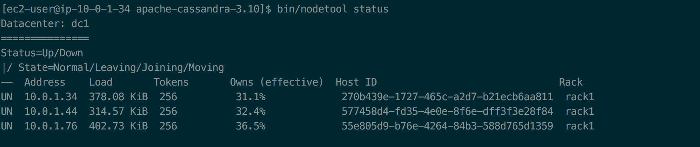

### Kong API Gateway
This documents covers these major topics
- [Setting up a Kong API Gateway backed by a 3 Node Cassandra
  configuration](README.md)
- [Configuring API routes in Kong](kong.md)
- [Running Kong/Cassandra Instance via Docker](docker.md)
- [Installing Kong/Cassandra via AWS CloudFormation template](cloud.md)

### Setting up Kong + 3 Node Cassandra configuration
- Create VPC with public + private subnet
  - Use the VPC Wizard
  - Select option 2 with both public and private subnets
  - Select an elastic IP for the NAT gateway
- Create an EC2 instance in the public subnet 
  - This will host the Kong Gateway
  - This can be a normal Amazon Linux t2.micro instance
  - This will also act as a bastion node to connect to the cassandra nodes
- Create 3 EC2 instances in the private subnet
  - This will host the Kong Gateway
  - This can be a normal Amazon Linux t2.micro instance
  - Open the following ports in the security group - 7000, 7001, 7199, 9042,
    9160
### Install Cassandra on all 3 instances
  - Connecting to instance on private subnet
    - Connect (via ssh) to the EC2 instance on the public subnet and from there connect to the instances on the private subnets through the private IP
    - https://aws.amazon.com/blogs/security/securely-connect-to-linux-instances-running-in-a-private-amazon-vpc/
### Install java
  - It has been noticed that the oracle jre is more stable than the open-jdk
    java installation when running on t2.micro instances under memory
    pressure
  - Steps to install java
    ```
    cd ~
    wget --no-cookies --no-check-certificate --header "Cookie: gpw_e24=http%3A%2F%2Fwww.oracle.com%2F; oraclelicense=accept-securebackup-cookie" \
    "http://download.oracle.com/otn-pub/java/jdk/8u60-b27/jre-8u60-linux-x64.rpm"
    sudo yum localinstall jre-8u60-linux-x64.rpm

    # Check your installation with 
    java -version
    
    # Install JNA
    sudo yum install jna

    # Set JAVA_HOME
    export JAVA_HOME=/usr/java/jre1.8.0_60
    ```

### Steps to install Cassandra
    ```
    # Download latest cassandra distribution
    curl -LO http://www-us.apache.org/dist/cassandra/3.10/apache-cassandra-3.10-bin.tar.gz
    tar -xvzf apache-cassandra-3.10-bin.tar.gz
    cd apache-cassandra-3.10
    ```

    - Optimize the Linux instance for running cassandra
      - https://docs.datastax.com/en/landing_page/doc/landing_page/recommendedSettings.html#recommendedSettings__jvm

### Configure Cassandra Cluster
   - In all the cassandra installations modify the conf/cassandra.yaml file to
     reflect these settings
     ```
     cluster_name: 'Kong Cluster'
     seeds: "server_1_ip,server_3_ip,server_3_ip"
     listen_address: current_instance_ip
     rpc_address: current_instance_ip
     endpoint_snitch: GossipingPropertyFileSnitch
     ```

  - Run Cassandra
    - Run cassandra by executing the bin/cassandra file. Start the instances in
      the same order that you have specified in the seeds parameter
  - Check cassandra cluster status with nodetool status command. You should see
    something like this
    

### Install Kong on the public facing instance
  ```
  curl -LO https://github.com/Mashape/kong/releases/download/0.10.1/kong-0.10.1.aws.rpm
  sudo yum install kong-0.10.1.aws.rpm --nogpgcheck
  ```
  - Configure the Kong Instance at /etc/kong/kong.conf
    - Update the database to cassandra
    - Update the cassandra contact points
    ```
      kong start
    ```

  - Add API routes
    ```
      curl -i -X POST \
      --url http://localhost:8001/apis/ \
      --data 'name=sunnyvale' \
      --data 'upstream_url=http://ec2-54-67-122-67.us-west-1.compute.amazonaws.com' \
      --data 'uris=/sunnyvale'
    ```

  - Check if kong apis are accessible
    ```
    curl http://localhost:8001/apis
    #=> {"data":[],"total":0}
    ```
